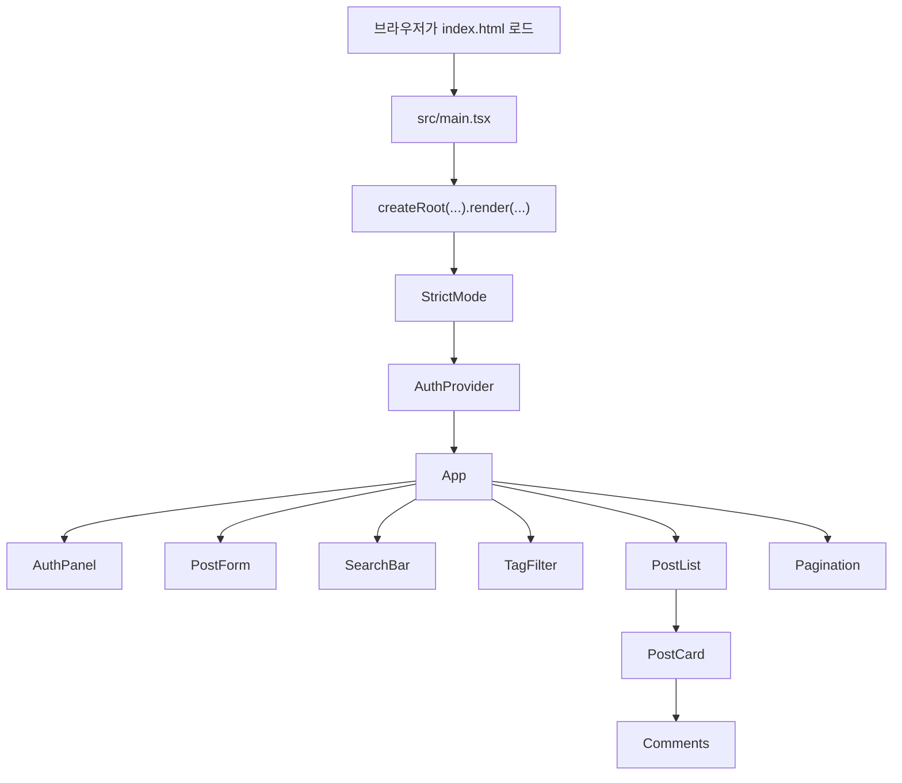
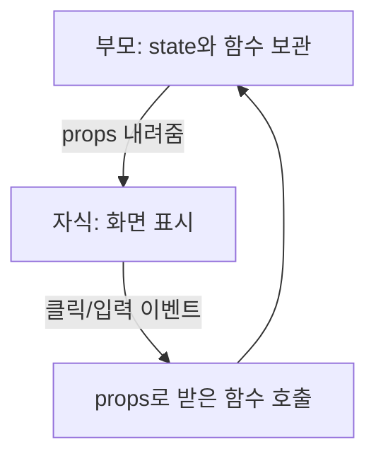
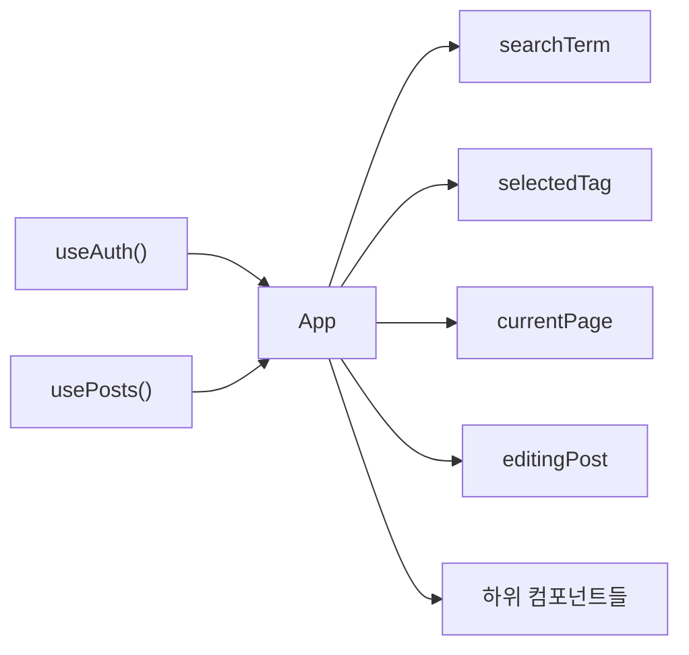
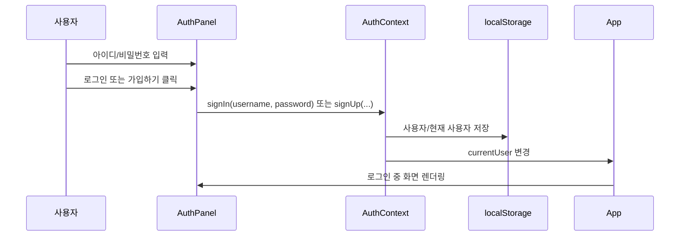
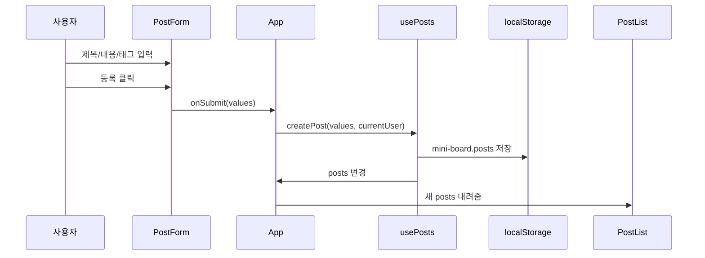
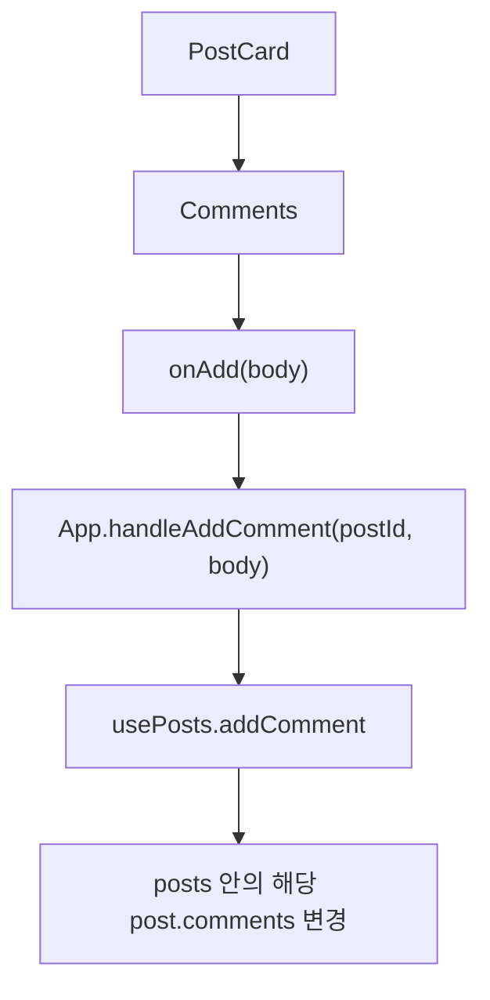
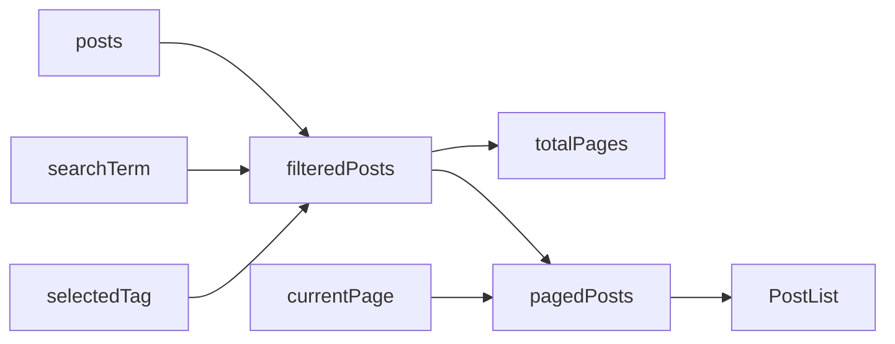
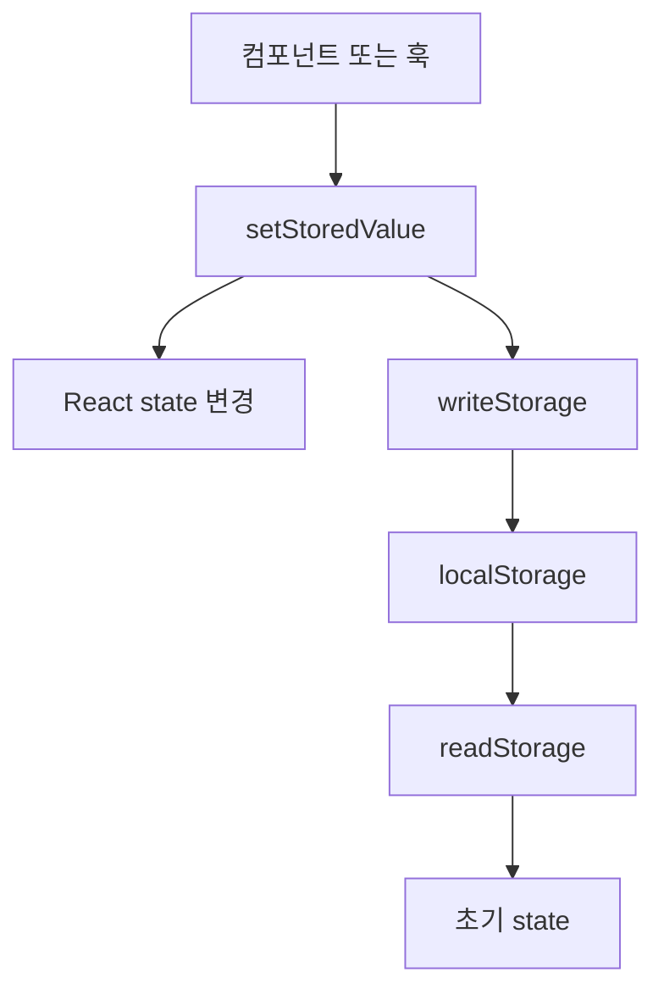

# React 프론트엔드 탑다운 읽기 가이드

이 문서는 소스 코드를 파일 순서대로 설명하지 않습니다.

먼저 이 앱이 최종적으로 어떤 화면과 데이터를 만들려는지 보고, 그 다음에 `main.tsx`에서 시작된 React 흐름이 `App`, `AuthContext`, `usePosts`, 각 컴포넌트로 어떻게 퍼지는지 따라갑니다.

## 0. 최종 데이터 구조 먼저 보기

이 프론트엔드는 서버 없이 브라우저의 `localStorage`에 데이터를 저장하는 미니 게시판입니다. 핵심 데이터는 사용자, 현재 로그인 사용자, 게시글입니다.

```json
{
  "mini-board.users": [
    {
      "id": "user_xxx",
      "username": "tester",
      "password": "1234"
    }
  ],
  "mini-board.current-user": {
    "id": "user_xxx",
    "username": "tester"
  },
  "mini-board.posts": [
    {
      "id": "post_xxx",
      "title": "첫 게시글",
      "content": "내용입니다",
      "tags": ["react", "typescript"],
      "authorId": "user_xxx",
      "authorName": "tester",
      "createdAt": "2026-06-12T00:00:00.000Z",
      "updatedAt": "2026-06-12T00:00:00.000Z",
      "comments": [
        {
          "id": "comment_xxx",
          "postId": "post_xxx",
          "body": "댓글입니다",
          "authorId": "user_xxx",
          "authorName": "tester",
          "createdAt": "2026-06-12T00:00:00.000Z"
        }
      ]
    }
  ]
}
```

```text
이 앱의 목표:
사용자가 회원가입/로그인하고, 게시글과 댓글을 작성하며,
검색/태그/페이지네이션으로 게시글 목록을 볼 수 있게 한다.
```

## 1. 전체 실행 흐름



가장 먼저 볼 파일은 `src/main.tsx`입니다.

```tsx
createRoot(document.getElementById("root")!).render(
  <StrictMode>
    <AuthProvider>
      <App />
    </AuthProvider>
  </StrictMode>,
);
```

여기서 중요한 점은 `<App />`이 혼자 렌더링되지 않는다는 것입니다. `<AuthProvider>`가 `<App />`을 감싸고 있습니다. 그래서 `App` 아래의 모든 컴포넌트는 `useAuth()`로 로그인 상태와 로그인/회원가입/로그아웃 함수를 꺼내 쓸 수 있습니다.

## 2. React에서 먼저 잡아야 할 개념

이 섹션의 목표는 React 문법을 전부 외우는 것이 아닙니다. `App.tsx`에서 출발했을 때 "이 JSX가 어떤 컴포넌트를 호출하고, props/state가 어디로 흐르고, `.ts` 파일은 언제 보러 가야 하는지"를 잡는 것입니다.

### 2.1 Component와 JSX는 다르다

컴포넌트는 화면 조각을 만드는 함수입니다.

JSX는 그 화면 조각을 HTML처럼 적는 문법입니다.

예를 들어 `SearchBar.tsx`에는 `SearchBar`라는 컴포넌트가 있고, 그 컴포넌트가 JSX를 반환합니다.

```tsx
export function SearchBar({ value, onChange }: SearchBarProps) {
  return (
    <label className="search-bar">
      검색
      <input
        value={value}
        onChange={(event) => onChange(event.target.value)}
      />
    </label>
  );
}
```

여기서 나눠 보면:

| 코드 | 정체 |
| --- | --- |
| `SearchBar` | 컴포넌트 함수 |
| `return (...)` 안쪽 | JSX |
| `<label>`, `<input>` | 브라우저에 그릴 HTML 계열 태그 |
| `{value}` | JSX 안에 들어간 JavaScript 값 |
| `onChange={...}` | 입력이 바뀔 때 실행할 함수 |

컴포넌트는 보통 대문자로 시작합니다. JSX에서 대문자로 쓰면 React가 컴포넌트로 보고 렌더링할 때 함수처럼 실행합니다.

```tsx
<SearchBar value={searchTerm} onChange={setSearchTerm} />
```

위 코드는 직접 `SearchBar(...)`라고 부르지 않았지만, React가 렌더링 과정에서 `SearchBar` 컴포넌트를 실행합니다.

### 2.2 `.tsx`와 `.ts`의 관계

이 프로젝트에서 파일 확장자는 보통 이렇게 읽으면 됩니다.

| 파일 | 의미 | 예시 |
| --- | --- | --- |
| `.tsx` | JSX가 들어갈 수 있는 TypeScript 파일 | `App.tsx`, `PostCard.tsx`, `AuthPanel.tsx` |
| `.ts` | JSX가 없는 TypeScript 파일 | `types.ts`, `usePosts.ts`, `storage.ts`, `id.ts` |

`.tsx`는 보통 화면을 담당합니다.

```tsx
// App.tsx
return <SearchBar value={searchTerm} onChange={setSearchTerm} />;
```

`.ts`는 보통 화면 밖의 타입, 계산, 저장, 데이터 변경 로직을 담당합니다.

```ts
// types.ts
export type Post = {
  id: string;
  title: string;
  content: string;
};
```

하지만 `.ts`가 무조건 함수만 들어있는 파일이라는 뜻은 아닙니다. JSX가 없다는 뜻입니다. 타입, 상수, 일반 함수, custom hook이 모두 들어갈 수 있습니다.

```text
.tsx: 화면과 JSX를 읽는 곳
.ts: 화면이 쓰는 타입/로직/저장 함수를 읽는 곳
```

### 2.3 Import는 파일 사이의 연결선이다

`App.tsx` 위쪽을 보면 다른 파일에서 컴포넌트와 함수를 가져옵니다.

```tsx
import { SearchBar } from "./features/search/SearchBar";
import { usePosts } from "./hooks/usePosts";
import type { Post, PostFormValues } from "./types";
```

읽는 법은 단순합니다.

| import 코드 | 어디를 보러 가면 되는가 |
| --- | --- |
| `./features/search/SearchBar` | `src/features/search/SearchBar.tsx` |
| `./hooks/usePosts` | `src/hooks/usePosts.ts` |
| `./types` | `src/types.ts` |

중요한 점은 `App.tsx`가 모든 코드를 한 파일에 들고 있지 않다는 것입니다. `App.tsx`는 필요한 부품을 import한 뒤, JSX 안에서 조립합니다.

### 2.4 Props는 부모가 자식에게 내려주는 값이다

`App.tsx`의 이 코드를 기준으로 보면:

```tsx
<SearchBar value={searchTerm} onChange={setSearchTerm} />
```

`App`이 `SearchBar`에게 두 개의 props를 내려줍니다.

| props 이름 | 내려가는 값 | 의미 |
| --- | --- |
| `value` | `searchTerm` | 현재 검색어 |
| `onChange` | `setSearchTerm` | 검색어를 바꾸는 함수 |

`SearchBar.tsx`는 이렇게 받습니다.

```tsx
type SearchBarProps = {
  value: string;
  onChange: (value: string) => void;
};

export function SearchBar({ value, onChange }: SearchBarProps) {
  // ...
}
```

여기서 `SearchBar`는 `searchTerm`이라는 이름을 모릅니다. 자식은 부모의 state 이름을 몰라도 됩니다. 자식은 그냥 `value`와 `onChange`라는 props만 압니다.

### 2.5 State는 컴포넌트가 직접 기억하는 값이다

`App.tsx`에는 이런 state들이 있습니다.

```tsx
const [searchTerm, setSearchTerm] = useState("");
const [selectedTag, setSelectedTag] = useState("");
const [currentPage, setCurrentPage] = useState(1);
const [editingPost, setEditingPost] = useState<Post | null>(null);
```

읽는 법:

| 코드 | 의미 |
| --- | --- |
| `searchTerm` | 현재 검색어 값 |
| `setSearchTerm` | 검색어를 바꾸는 함수 |
| `useState("")` | 처음 값은 빈 문자열 |

state는 직접 대입하지 않습니다.

```tsx
searchTerm = "react"; // 이렇게 하지 않음
setSearchTerm("react"); // setter로 바꿈
```

setter를 호출하면 React가 다시 렌더링합니다.

```text
setSearchTerm("react")
-> App 다시 실행
-> filteredPosts 다시 계산
-> PostList에 새 posts가 props로 내려감
```

### 2.6 Props와 state를 같이 보면 흐름이 보인다

React 파일을 읽을 때는 이 방향을 먼저 잡으면 됩니다.



검색창 흐름을 실제 파일 기준으로 쓰면:

```text
App.tsx
-> searchTerm state를 가지고 있음
-> SearchBar에 value, onChange props로 내려줌

SearchBar.tsx
-> input에 value 표시
-> 사용자가 입력하면 onChange(event.target.value) 호출

App.tsx
-> setSearchTerm이 실행됨
-> App이 다시 렌더링됨
-> filteredPosts가 새 검색어로 다시 만들어짐
```

```text
props는 위에서 아래로 내려간다.
이벤트 결과는 아래에서 위로 올라간다.
```

### 2.7 Event handler는 버튼과 입력에서 출발한다

`onClick`, `onChange`, `onSubmit`을 만나면 "사용자가 뭘 하면 이 함수가 실행되는구나"라고 읽으면 됩니다.

```tsx
<input
  value={searchTerm}
  onChange={(event) => setSearchTerm(event.target.value)}
/>
```

| 이벤트 | 언제 실행되는가 | 이 프로젝트 예시 |
| --- | --- |
| `onChange` | input 값이 바뀔 때 | 검색어, 아이디, 비밀번호 입력 |
| `onClick` | 버튼을 클릭할 때 | 태그 선택, 수정, 삭제, 페이지 이동 |
| `onSubmit` | form을 제출할 때 | 로그인, 회원가입, 게시글 등록, 댓글 등록 |

예를 들어 게시글 등록 버튼을 누르면:

```text
PostForm.tsx의 form onSubmit
-> PostForm.handleSubmit
-> props로 받은 onSubmit(values) 호출
-> App.tsx의 handlePostSubmit 실행
-> usePosts.ts의 createPost 또는 updatePost 실행
```

### 2.8 Hook과 custom hook은 `use...` 함수다

Hook은 `use`로 시작하는 함수입니다. React 기능이나 공통 로직을 컴포넌트에서 쓰기 위한 API입니다.

| Hook | 지금은 이렇게 이해 |
| --- | --- |
| `useState` | 컴포넌트가 값을 기억함 |
| `useEffect` | 특정 값이 바뀐 뒤 추가 작업을 함 |
| `useMemo` | 계산 결과를 필요할 때만 다시 만듦 |
| `useContext` | Context에 저장된 공통 값을 꺼냄 |

이 프로젝트에는 직접 만든 custom hook도 있습니다.

| Custom hook | 파일 | 역할 |
| --- | --- | --- |
| `useAuth()` | `features/auth/AuthContext.tsx` | 로그인 상태와 로그인/회원가입/로그아웃 함수 제공 |
| `usePosts()` | `hooks/usePosts.ts` | 게시글/댓글 배열과 CRUD 함수 제공 |
| `useLocalStorage()` | `hooks/useLocalStorage.ts` | React state와 `localStorage`를 같이 갱신 |

`App.tsx`에서는 이렇게 사용합니다.

```tsx
const { currentUser } = useAuth();
const { posts, createPost, updatePost, deletePost, addComment, deleteComment } = usePosts();
```

즉 `App.tsx`가 로그인과 게시글 로직을 직접 전부 가지고 있는 것이 아닙니다. `useAuth()`와 `usePosts()`에서 가져와서 화면 컴포넌트들에 나눠줍니다.

### 2.9 Context는 멀리 있는 컴포넌트도 같은 값을 쓰게 해준다

`main.tsx`에서 `AuthProvider`가 `App`을 감쌉니다.

```tsx
<AuthProvider>
  <App />
</AuthProvider>
```

그래서 `App` 아래쪽 컴포넌트들은 `useAuth()`로 로그인 상태를 꺼낼 수 있습니다.

```tsx
const { currentUser, signIn, signUp, signOut } = useAuth();
```

이 프로젝트에서 로그인 상태는 여러 곳에 필요합니다.

| 필요한 곳 | 이유 |
| --- | --- |
| `App.tsx` | 로그인 여부에 따라 작성 폼 표시 |
| `AuthPanel.tsx` | 로그인/회원가입/로그아웃 처리 |
| `PostCard.tsx` | 내 글이면 수정/삭제 버튼 표시 |
| `Comments.tsx` | 로그인해야 댓글 작성 가능 |

이런 값을 매번 props로 깊게 내려주면 복잡해집니다. 그래서 `AuthContext`로 공유합니다.

### 2.10 컴포넌트를 읽는 고정 순서

어떤 `.tsx` 파일을 열든 아래 순서로만 보면 됩니다.

```text
1. import를 본다: 이 파일이 어디에 의존하는가?
2. Props 타입을 본다: 부모에게 뭘 받는가?
3. useState를 본다: 이 컴포넌트가 직접 기억하는 값은 뭔가?
4. handler 함수를 본다: 클릭/입력/제출 때 뭘 하는가?
5. return JSX를 본다: 화면에 뭘 그리는가?
6. 자식 컴포넌트를 본다: 어떤 props를 또 내려주는가?
```

예를 들어 `AuthPanel.tsx`는 이렇게 정리됩니다.

| 항목 | 내용 |
| --- | --- |
| import | `useState`, `useAuth` |
| props | 없음 |
| state | `mode`, `username`, `password`, `errorMessage` |
| handler | `handleSubmit` |
| 외부 함수 호출 | `signIn`, `signUp`, `signOut` |
| 화면 분기 | `currentUser`가 있으면 로그인 중 화면, 없으면 폼 |

### 2.11 자주 헷갈리는 모양 빠른 정리

React 코드를 처음 읽을 때 헷갈리는 이유는 같은 괄호가 여러 역할로 쓰이고, 함수 안에 또 다른 함수가 들어가는 코드가 많기 때문입니다. 아래 용어만 먼저 잡으면 `App.tsx`를 훨씬 쉽게 읽을 수 있습니다.

| 용어 | 짧은 뜻 | 이 프로젝트 예시 |
| --- | --- | --- |
| 렌더링 | 컴포넌트 함수를 실행해서 JSX를 다시 계산하는 일 | `App()`이 실행되고 화면 구조가 만들어짐 |
| state | 컴포넌트가 기억하는 값 | `searchTerm`, `selectedTag`, `currentPage` |
| setter | state를 바꾸는 함수 | `setSearchTerm`, `setSelectedTag` |
| props | 부모가 자식에게 내려주는 값 | `<SearchBar value={searchTerm} onChange={setSearchTerm} />` |
| event handler | 클릭, 입력, 제출 때 실행되는 함수 | `handlePostSubmit`, `handleDeletePost` |
| hook | React 기능을 쓰는 `use...` 함수 | `useState`, `useEffect`, `useMemo`, `useAuth` |
| custom hook | 직접 만든 hook | `usePosts`, `useLocalStorage`, `useAuth` |
| dependency array | hook이 다시 실행/계산할 기준 배열 | `[posts]`, `[posts, searchTerm, selectedTag]` |

React에서 자주 보이는 괄호는 아래처럼 나눠서 읽으면 됩니다.

| 모양 | 뜻 |
| --- | --- |
| `useMemo(...)` | `useMemo`라는 함수를 호출 |
| `() => { ... }` | 매개변수가 없는 함수를 만듦 |
| `(post) => { ... }` | `post` 매개변수 하나를 받는 함수를 만듦 |
| `[posts]` | 배열. `useMemo`에서는 다시 계산할 기준 |
| `{searchTerm}` | JSX 안에서 JavaScript 값을 넣음 |

예를 들어 이 코드는:

```tsx
const result = useMemo(() => {
  return posts.length;
}, [posts]);
```

이렇게 쪼개서 볼 수 있습니다.

```tsx
const 계산할함수 = () => {
  return posts.length;
};

const 다시계산할기준 = [posts];

const result = useMemo(계산할함수, 다시계산할기준);
```

즉 `useMemo(() => { ... }, [posts])`는 "함수 하나와 배열 하나를 `useMemo`에 넘긴다"는 뜻입니다. `[posts]`는 `() => { ... }` 함수의 매개변수가 아닙니다.

### 2.12 처음부터 모든 파일을 보지 않는 방법

`App.tsx`를 열었을 때 모든 import를 한 번에 따라가면 길을 잃기 쉽습니다. 화면에서 보고 싶은 기능 하나만 정해서 따라가면 됩니다.

```text
로그인이 궁금하다
-> App.tsx의 <AuthPanel />
-> AuthPanel.tsx
-> AuthContext.tsx
-> storage.ts
```

```text
게시글 등록이 궁금하다
-> App.tsx의 <PostForm ... onSubmit={handlePostSubmit} />
-> PostForm.tsx
-> App.tsx의 handlePostSubmit
-> usePosts.ts의 createPost/updatePost
-> useLocalStorage.ts, storage.ts
```

```text
검색이 궁금하다
-> App.tsx의 <SearchBar value={searchTerm} onChange={setSearchTerm} />
-> SearchBar.tsx
-> App.tsx의 filteredPosts
-> PostList.tsx
```

이렇게 한 줄씩만 따라가면 됩니다. `App.tsx`는 출발점이고, 실제 기능의 세부 로직은 각 컴포넌트와 hook 파일로 나뉘어 있습니다.

## 3. `App.tsx`가 화면의 교통정리를 한다

`App`은 이 앱의 중앙 조립 지점입니다.



`App`이 직접 들고 있는 상태는 네 가지입니다.

| 상태 | 역할 |
| --- | --- |
| `searchTerm` | 검색창 입력값 |
| `selectedTag` | 선택된 태그 |
| `currentPage` | 현재 페이지 번호 |
| `editingPost` | 지금 수정 중인 게시글 |

반대로 로그인 사용자와 게시글 목록은 `App` 안에서 직접 만들지 않습니다.

```tsx
const { currentUser } = useAuth();
const { posts, createPost, updatePost, deletePost, addComment, deleteComment } = usePosts();
```

이 구조를 이해하면 `App`의 역할이 명확해집니다.

```text
AuthContext: 로그인 관련 상태와 함수 제공
usePosts: 게시글/댓글 관련 상태와 함수 제공
App: 둘을 가져와 화면 컴포넌트에 필요한 props로 나눠줌
```

### 3.1 `App.tsx`에서 화면 섹션별로 따라가는 길

`App.tsx`를 읽을 때는 `return (...)` 안쪽을 화면 지도처럼 보면 됩니다. 화면에서 관심 있는 영역을 하나 고르고, 그 JSX 태그를 눌러 해당 파일로 이동합니다.

| 화면에서 보는 부분 | `App.tsx`에서 찾을 코드 | 먼저 갈 파일 | 그 다음 볼 곳 |
| --- | --- | --- | --- |
| 로그인/회원가입/로그아웃 | `<AuthPanel />` | `src/features/auth/AuthPanel.tsx` | `useAuth()`를 따라 `src/features/auth/AuthContext.tsx` |
| 새 게시물 작성/수정 | `<PostForm ... />` | `src/features/posts/PostForm.tsx` | `onSubmit`을 따라 `App.tsx`의 `handlePostSubmit` |
| 검색창 | `<SearchBar ... />` | `src/features/search/SearchBar.tsx` | `setSearchTerm` 이후 `App.tsx`의 `filteredPosts` |
| 태그 버튼 | `<TagFilter ... />` | `src/features/tags/TagFilter.tsx` | `setSelectedTag` 이후 `App.tsx`의 `filteredPosts` |
| 게시글 목록 | `<PostList ... />` | `src/features/posts/PostList.tsx` | `PostCard.tsx`, 그리고 안쪽의 `Comments.tsx` |
| 게시글 수정/삭제 버튼 | `PostList`에 내려준 `onEdit`, `onDelete` | `src/features/posts/PostCard.tsx` | `App.tsx`의 `setEditingPost`, `handleDeletePost` |
| 댓글 등록/삭제 | `PostList`에 내려준 `onAddComment`, `onDeleteComment` | `src/features/comments/Comments.tsx` | `PostCard.tsx`가 `post.id`를 붙이고, `App.tsx` handler로 이동 |
| 페이지 이동 | `<Pagination ... />` | `src/features/pagination/Pagination.tsx` | `setCurrentPage` 이후 `App.tsx`의 `pagedPosts` |

예를 들어 화면에서 검색창이 궁금하면 아래 한 줄만 따라갑니다.

```text
App.tsx의 <SearchBar value={searchTerm} onChange={setSearchTerm} />
-> SearchBar.tsx
-> input onChange
-> App.tsx의 setSearchTerm
-> App.tsx의 filteredPosts
-> PostList.tsx
```

게시글 등록이 궁금하면 다른 파일을 동시에 보지 말고 이 길만 따라갑니다.

```text
App.tsx의 <PostForm editingPost={editingPost} onSubmit={handlePostSubmit} />
-> PostForm.tsx
-> form onSubmit
-> PostForm의 handleSubmit
-> props로 받은 onSubmit(values)
-> App.tsx의 handlePostSubmit
-> usePosts.ts의 createPost 또는 updatePost
```

로그인이 궁금하면 이 길만 보면 됩니다.

```text
App.tsx의 <AuthPanel />
-> AuthPanel.tsx
-> form onSubmit 또는 로그아웃 onClick
-> useAuth()에서 받은 signIn/signUp/signOut
-> AuthContext.tsx
-> storage.ts
```

이 방식으로 읽으면 `App.tsx`가 갑자기 여러 파일로 흩어지는 것이 아니라, 화면 섹션마다 정해진 길이 있는 구조로 보입니다.

## 4. 인증 흐름: `AuthPanel`에서 `AuthContext`로 간다



`AuthPanel`은 입력 폼입니다. 여기에는 `mode`, `username`, `password`, `errorMessage` 같은 폼 전용 state가 있습니다.

```tsx
const [mode, setMode] = useState<AuthMode>("login");
const [username, setUsername] = useState("");
const [password, setPassword] = useState("");
const [errorMessage, setErrorMessage] = useState("");
```

폼 제출 시 핵심 흐름은 이 부분입니다.

```tsx
const result =
  mode === "login" ? signIn(username, password) : signUp(username, password);
```

`AuthPanel`은 실제 계정 저장 로직을 알지 않습니다. `signIn`, `signUp` 함수만 호출합니다. 실제 로직은 `AuthContext.tsx`의 `AuthProvider` 안에 있습니다.

`AuthContext`가 하는 일은 세 가지입니다.

| 함수 | 역할 |
| --- | --- |
| `signUp` | 아이디/비밀번호 검증 후 사용자 생성 |
| `signIn` | 저장된 사용자 중 일치하는 계정 찾기 |
| `signOut` | 현재 로그인 사용자 제거 |

`useAuth()`는 Context를 쉽게 꺼내 쓰기 위한 커스텀 훅입니다.

```tsx
export function useAuth() {
  const context = useContext(AuthContext);

  if (!context) {
    throw new Error("useAuth must be used inside AuthProvider.");
  }

  return context;
}
```

이 에러는 `AuthProvider` 바깥에서 `useAuth()`를 호출하면 발생합니다. 현재는 `main.tsx`에서 `<AuthProvider>`가 `<App />`을 감싸므로 정상입니다.

## 5. 게시글 흐름: `PostForm`에서 `usePosts`로 간다



`PostForm`은 입력값만 관리합니다.

| state | 역할 |
| --- | --- |
| `title` | 제목 입력 |
| `content` | 내용 입력 |
| `tagText` | 쉼표로 구분된 태그 입력 |
| `errorMessage` | 제목/내용 누락 에러 |

`PostForm`은 게시글 배열을 직접 수정하지 않습니다. 제출할 때 `onSubmit`만 호출합니다.

```tsx
onSubmit({
  title,
  content,
  tags: parseTags(),
});
```

그 다음 `App`의 `handlePostSubmit`이 새 글 작성인지 수정인지 판단합니다.

```tsx
if (editingPost) {
  updatePost(editingPost.id, values, currentUser.id);
  setEditingPost(null);
  return;
}

createPost(values, currentUser);
```

실제 배열 변경은 `usePosts.ts`가 담당합니다.

```text
PostForm: 입력 UI
App: 작성인지 수정인지 판단
usePosts: posts 배열 변경과 localStorage 저장
```

## 6. 댓글 흐름: `Comments`는 게시글 안쪽 기능이다



댓글은 독립된 큰 데이터가 아니라 각 게시글의 `comments` 배열 안에 들어갑니다.

`PostCard`는 특정 게시글 하나를 받습니다. 그리고 댓글 컴포넌트에 현재 게시글 기준 함수로 바꿔서 넘깁니다.

```tsx
<Comments
  comments={post.comments}
  currentUser={currentUser}
  onAdd={(body) => onAddComment(post.id, body)}
  onDelete={(commentId) => onDeleteComment(post.id, commentId)}
/>
```

여기서 중요한 패턴은 `post.id`를 미리 묶어서 자식에게 넘기는 것입니다. 그래서 `Comments`는 자신이 어느 게시글에 붙어 있는지 몰라도 됩니다.

```text
Comments는 댓글 입력과 삭제 버튼만 안다.
PostCard가 "이 댓글은 이 게시글의 댓글이다"라는 맥락을 붙여준다.
```

## 7. 검색, 태그, 페이지네이션은 서버 요청이 아니다

이 앱의 검색과 태그 필터는 브라우저 안에 이미 있는 `posts` 배열을 가공하는 방식입니다.



`filteredPosts`는 `useMemo`로 계산됩니다.

```tsx
const filteredPosts = useMemo(() => {
  const keyword = normalize(searchTerm);

  return posts.filter((post) => {
    const matchesTag = selectedTag ? post.tags.includes(selectedTag) : true;
    const searchableText = normalize(
      [post.title, post.content, post.authorName, post.tags.join(" ")].join(" "),
    );
    const matchesSearch = keyword ? searchableText.includes(keyword) : true;

    return matchesTag && matchesSearch;
  });
}, [posts, searchTerm, selectedTag]);
```

`useMemo`는 "이 값은 `posts`, `searchTerm`, `selectedTag`가 바뀔 때만 다시 계산하겠다"는 뜻입니다. 초보 단계에서는 최적화보다 의존성 배열을 읽는 연습이 중요합니다.

```text
의존성 배열 [posts, searchTerm, selectedTag]:
이 세 값 중 하나가 바뀌면 filteredPosts도 다시 계산된다.
```

### 7.1 `allTags`와 `filteredPosts`의 `useMemo` 비교

두 코드는 모양이 조금 다르게 보이지만 둘 다 같은 구조입니다.

```tsx
useMemo(계산할함수, 다시계산할기준배열)
```

`allTags`는 게시글 목록에서 태그만 뽑아 만드는 값입니다.

```tsx
const allTags = useMemo(
  () =>
    Array.from(new Set(posts.flatMap((post) => post.tags))).sort((a, b) =>
      a.localeCompare(b),
    ),
  [posts],
);
```

읽는 법:

```text
계산할 값: 모든 게시글의 tags를 모아서 중복 제거 후 정렬한 배열
다시 계산할 기준: posts
이유: 태그 목록은 posts가 바뀔 때만 달라짐
```

`filteredPosts`는 게시글 목록, 검색어, 선택된 태그를 모두 보고 만드는 값입니다.

```tsx
const filteredPosts = useMemo(() => {
  const keyword = normalize(searchTerm);

  return posts.filter((post) => {
    const matchesTag = selectedTag ? post.tags.includes(selectedTag) : true;
    const searchableText = normalize(
      [post.title, post.content, post.authorName, post.tags.join(" ")].join(" "),
    );
    const matchesSearch = keyword ? searchableText.includes(keyword) : true;

    return matchesTag && matchesSearch;
  });
}, [posts, searchTerm, selectedTag]);
```

읽는 법:

```text
계산할 값: 검색어와 태그 조건을 통과한 게시글 배열
다시 계산할 기준: posts, searchTerm, selectedTag
이유: 게시글 목록, 검색어, 선택 태그 중 하나만 바뀌어도 결과가 달라짐
```

여기서 `return`이 두 번 나오는 이유는 서로 다른 함수의 `return`이기 때문입니다.

```tsx
return posts.filter(...)
```

이 `return`은 `useMemo` 안의 함수가 최종 결과를 반환합니다. 이 값이 `filteredPosts`가 됩니다.

```tsx
return matchesTag && matchesSearch;
```

이 `return`은 `filter` 안의 함수가 각 게시글을 남길지 말지 판단합니다. `true`면 남고, `false`면 빠집니다.

의존성 배열은 매개변수가 아니라 "캐시를 다시 만들 기준"입니다.

```text
매개변수처럼 함수 안으로 들어가는 값이 아니다.
이미 App 안에 있는 posts, searchTerm, selectedTag를 사용하고,
React에게 "이 값들이 바뀌면 다시 계산해"라고 알려주는 배열이다.
```

### 7.2 `useMemo`와 `useEffect` 차이

두 hook 모두 두 번째 인자로 dependency array를 받을 수 있지만 목적이 다릅니다.

| Hook | 목적 | 결과 |
| --- | --- | --- |
| `useMemo` | 계산한 값을 기억했다가 필요할 때만 다시 계산 | 값을 반환함 |
| `useEffect` | 렌더링이 끝난 뒤 추가 작업을 실행 | 값을 반환하지 않음 |

`useMemo` 예시:

```tsx
const filteredPosts = useMemo(() => {
  return posts.filter(...);
}, [posts, searchTerm, selectedTag]);
```

의미:

```text
filteredPosts라는 계산 결과가 필요하다.
posts, searchTerm, selectedTag가 바뀔 때만 다시 계산한다.
```

`useEffect` 예시:

```tsx
useEffect(() => {
  setCurrentPage(1);
}, [searchTerm, selectedTag]);
```

의미:

```text
검색어 또는 태그가 바뀐 뒤에는 현재 페이지를 1페이지로 돌린다.
이 코드는 값을 만드는 것이 아니라 추가 행동을 실행한다.
```

다른 `useEffect`도 같은 방식으로 읽습니다.

```tsx
useEffect(() => {
  if (currentPage > totalPages) {
    setCurrentPage(totalPages);
  }
}, [currentPage, totalPages]);
```

의미:

```text
현재 페이지가 전체 페이지 수보다 커지는 상황을 막는다.
currentPage나 totalPages가 바뀐 뒤 검사한다.
```

정리하면:

```text
useMemo: "이 값을 어떻게 계산하지?"
useEffect: "렌더링 후 어떤 행동을 해야 하지?"
dependency array: "어떤 값이 바뀌면 다시 할까?"
```

페이지네이션은 필터링된 결과에서 현재 페이지에 해당하는 부분만 잘라서 만듭니다.

```tsx
const pagedPosts = filteredPosts.slice(
  (currentPage - 1) * PAGE_SIZE,
  currentPage * PAGE_SIZE,
);
```

## 8. 저장 흐름: `useLocalStorage`와 `storage.ts`



`useLocalStorage`는 React state와 브라우저 저장소를 같이 다루기 위한 커스텀 훅입니다.

```tsx
const [value, setValue] = useState<T>(() => readStorage(key, fallback));
```

이 코드에서 `useState`에 함수가 들어간 이유는 초기 렌더링 때 한 번만 `localStorage`를 읽기 위해서입니다.

`setStoredValue`는 두 가지 일을 합니다.

| 작업 | 이유 |
| --- | --- |
| `setValue(...)` | React 화면을 다시 렌더링하기 위해 |
| `writeStorage(...)` | 새로고침 후에도 데이터가 남게 하기 위해 |

이 프로젝트에서는 `usePosts`가 `useLocalStorage`를 사용합니다. 인증 쪽은 `AuthContext`에서 `readStorage`, `writeStorage`를 직접 사용합니다.

## 9. 파일별로 무엇을 공부하면 좋은가

처음부터 모든 파일을 동시에 보지 말고 아래 순서대로 읽는 것이 좋습니다.

| 순서 | 파일 | 공부 포인트 |
| --- | --- | --- |
| 1 | `src/main.tsx` | React 앱이 어디서 시작되는지 |
| 2 | `src/App.tsx` | 전체 화면 조립, state, props 전달 |
| 3 | `src/types.ts` | 이 앱에서 다루는 데이터 모양 |
| 4 | `src/features/auth/AuthContext.tsx` | Context와 로그인 상태 공유 |
| 5 | `src/features/auth/AuthPanel.tsx` | 폼 입력, submit 이벤트, 조건부 렌더링 |
| 6 | `src/hooks/usePosts.ts` | 배열 state 변경, CRUD 함수 |
| 7 | `src/features/posts/PostForm.tsx` | 부모에게 값을 올려보내는 폼 컴포넌트 |
| 8 | `src/features/posts/PostList.tsx` | 배열을 `map`으로 컴포넌트 목록으로 바꾸기 |
| 9 | `src/features/posts/PostCard.tsx` | 게시글 하나의 표시와 수정/삭제 권한 |
| 10 | `src/features/comments/Comments.tsx` | 자식 컴포넌트에서 이벤트 올려보내기 |
| 11 | `src/features/search/SearchBar.tsx` | controlled input |
| 12 | `src/features/tags/TagFilter.tsx` | 선택 상태를 버튼 UI로 표현 |
| 13 | `src/features/pagination/Pagination.tsx` | 페이지 번호 계산과 이벤트 |
| 14 | `src/hooks/useLocalStorage.ts`, `src/lib/storage.ts` | 커스텀 훅과 브라우저 저장소 |

## 10. React 초심자 관점의 읽기 체크리스트

각 컴포넌트를 읽을 때 아래 질문만 반복해도 흐름이 잡힙니다.

```text
1. 이 컴포넌트는 어떤 props를 받는가?
2. 이 컴포넌트가 직접 가진 state는 무엇인가?
3. 사용자가 클릭하거나 입력하면 어떤 함수가 실행되는가?
4. 그 함수는 state를 바꾸는가, 부모 함수를 호출하는가?
5. state나 props가 바뀌면 JSX의 어떤 부분이 달라지는가?
```

예를 들어 `AuthPanel`은 이렇게 읽으면 됩니다.

| 질문 | 답 |
| --- | --- |
| props를 받는가? | 받지 않는다 |
| 직접 가진 state는? | `mode`, `username`, `password`, `errorMessage` |
| 외부에서 가져오는 값은? | `useAuth()`의 `currentUser`, `signIn`, `signUp`, `signOut` |
| 제출하면? | `signIn` 또는 `signUp` 호출 |
| 로그인되면? | 폼 대신 로그인 중 화면과 로그아웃 버튼 표시 |

## 11. 이 프로젝트의 핵심 패턴 세 가지

### 11.1 상태는 필요한 곳보다 조금 위에 둔다

검색어, 선택 태그, 현재 페이지는 여러 컴포넌트가 함께 영향을 받습니다. 그래서 `SearchBar`나 `TagFilter` 안이 아니라 `App`에 있습니다.

```text
SearchBar는 입력 UI만 담당
TagFilter는 태그 버튼 UI만 담당
App은 검색 결과와 페이지 계산 담당
```

### 11.2 자식은 직접 데이터를 고치지 않고 부모 함수를 호출한다

`PostForm`은 게시글 배열을 모릅니다. 대신 `onSubmit(values)`를 호출합니다.

`Comments`도 게시글 배열을 모릅니다. 대신 `onAdd(body)`와 `onDelete(commentId)`를 호출합니다.

이 방식 덕분에 하위 컴포넌트는 작고 단순해집니다.

### 11.3 Context는 여러 컴포넌트가 같이 써야 하는 값을 공유한다

로그인 상태는 `AuthPanel`, `App`, `PostForm`, `PostCard`, `Comments`에 모두 영향을 줍니다. 그래서 props로 깊게 전달하기보다 `AuthContext`로 공유합니다.

```text
Context를 쓰는 이유:
여러 위치에서 필요한 값을 중간 컴포넌트마다 계속 props로 전달하지 않기 위해서.
```

## 12. 실행할 때 보는 명령어

프로젝트 루트가 아니라 `Frontend` 폴더에서 실행합니다.

```sh
npm run dev
```

빌드 검사는 다음 명령어로 합니다.

```sh
npm run build
```

공부할 때는 브라우저에서 화면을 띄워놓고, 입력하거나 버튼을 누른 뒤 어떤 state와 함수가 움직이는지 소스에서 따라가는 방식이 가장 좋습니다.

## 13. 추천 공부 순서

React를 처음 공부한다면 이 프로젝트 기준으로는 아래 순서가 좋습니다.

1. JSX가 HTML처럼 보이지만 JavaScript 안에서 반환되는 값이라는 점 이해하기
2. `useState`로 입력값이 화면에 유지되는 방식 이해하기
3. `props`로 부모가 자식에게 값을 내려주는 방식 이해하기
4. `onClick`, `onChange`, `onSubmit` 이벤트 흐름 따라가기
5. `App.tsx`에서 상태를 모으고 자식 컴포넌트에 나눠주는 방식 보기
6. `useAuth`, `usePosts`, `useLocalStorage`처럼 `use`로 시작하는 커스텀 훅 보기
7. `useMemo`, `useEffect`, `Context`는 마지막에 다시 보기

처음부터 `useMemo`, `useEffect`, `Context`를 완벽히 이해하려고 하면 어렵습니다. 먼저 `state -> render -> event -> state 변경 -> 다시 render` 흐름을 잡는 것이 우선입니다.
